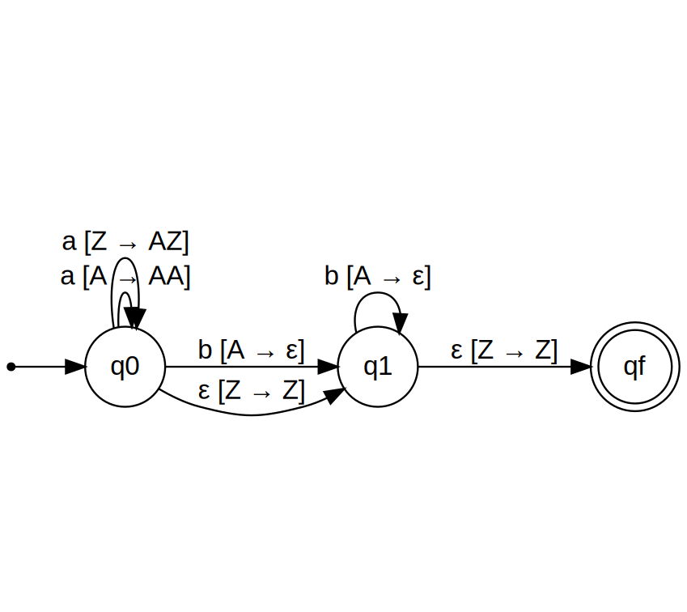

## Simulador de Autômato Finito de Pilha

### Lucas Elias de Andrade Cruvinel
#### Github: https://github.com/Lucrilhas/Trabalho02LFA

#### Introdução
Nesse trabalho foi realizado o trabalho de implementar um simulador de autômato 
finito de pilha que funcione tanto para autômatos deterministo (DFA) quanto não deterministico (NFA) e 
epsilon não deterministicos (e-NFA).

#### Requisitos
O código foi implementado utilizando a linguagem de programação Python, em especifico utilizando
a versão 3.10, embora não se tenha feito testes é esperado que funcione para qualquer versão
acima do 3.7. 

Além disso o ambiente de implementação foi em uma máquina com o sistema operacional
Windows 11, porém novamente mesmo sem ter feitos testes é esperado funcionar em qualquer máquina
que o Python tenha suprte.

#### Entradas
Para iniciar, é necessário preencher o arquivo 'entrada.txt' com os dados do autônomo,
sendo esses dados:

* Regras de Transição
* Pilha inicial, no caso sendo o símbolo de início da pilha.
* Estado inicial
* Estados finais
* Palavras

### Exemplo de entrada:
<!--
http://magjac.com/graphviz-visual-editor/?dot=digraph%20finite_state_machine%20%7B%0A%09fontname%3D%22Helvetica%2CArial%2Csans-serif%22%0A%09node%20%5Bfontname%3D%22Helvetica%2CArial%2Csans-serif%22%5D%0A%09edge%20%5Bfontname%3D%22Helvetica%2CArial%2Csans-serif%22%5D%0A%09rankdir%3DLR%3B%0A%09init%20%5Bshape%3Dpoint%5D%3B%20%0A%09node%5Bshape%20%3D%20doublecircle%5D%3B%0A%20%20%20%20qf%3B%0A%09node%20%5Bshape%20%3D%20circle%5D%3B%0A%09%0A%0A%09init%20-%3E%20q0%3B%0A%09q0%20-%3E%20q0%20%5Blabel%20%3D%20%22a%20%5BA%20%E2%86%92%20AA%5D%22%5D%3B%0A%09q0%20-%3E%20q0%20%5Blabel%20%3D%20%22a%20%5BZ%20%E2%86%92%20AZ%5D%22%5D%3B%0A%09q0%20-%3E%20q1%20%5Blabel%20%3D%20%22b%20%5BA%20%E2%86%92%20%CE%B5%5D%22%5D%3B%0A%09q0%20-%3E%20q1%20%5Blabel%20%3D%20%22%CE%B5%20%5BZ%20%E2%86%92%20Z%5D%22%5D%3B%0A%09q1%20-%3E%20q1%20%5Blabel%20%3D%20%22b%20%5BA%20%E2%86%92%20%CE%B5%5D%22%5D%3B%0A%09q1%20-%3E%20qf%20%5Blabel%20%3D%20%22%CE%B5%20%5BZ%20%E2%86%92%20Z%5D%22%5D%3B%0A%0A%0A%7D
-->
O seguinte automato de pilha pode ser inserido como:


```
Linguagem L = a^n b^n | n >= 0
{
    "transicoes":[
        q0, q0, a, Z, AZ
        q0, q0, a, A, AA
        q0, q1, b, A, E
        q0, q1, E, Z, Z
        q1, q1, b, A, E
        q1, qf, E, Z, Z
    ]
    "pilha_inicial": Z
    "estado_inicial": q0
    "estados_final":[
        qf
    ]
    "palavras":[
    ]
}
```

#### Execução

Para execução é necessário executar o arquivo '_ _ init_ _.py' utilizando o Python, sendo
a partir de comando via console ou utilizando uma IDE.

O arquivo '_ _ init_ _.py' serve apenas como uma função incial para chamar as outras funções.

Após a execução o código irá ler e interpretar os dados de entrada, interpretando-o e 
criando o resto dos dados como Alfabetos, Estados.

Toda a parte de leitura e execução do arquivo de entrada se encontra no arquivo 'textos.py' e
os dados ficam salvos como instancia da classe Autonomo que se encontra no arquivo 'automato.py'.

#### Como funciona?

Após a leitura do arquivo de entrada, é criado um simulador para cada automato inserido, e para
cada automato inserido é verificado cada palavra de entrada e analisado se a palavra pertence ou 
não ao automato.

Para verificação de uma palavra é criado uma fila de operações, onde cada elemento dessa fila 
será uma Tupla que contém o estado atual, o restante da palavra e o estado da pilha.

Essa fila é inicializada com um elemento que contém o estado inicial, a palavra completa e uma pilha
 vazia.

A partir disso é inicializado um loop que irá iterar até que a fila de operações esteja vazia ou que
uma operação mostre que a palavra funciona para aquele automato.

Dentro desse loop, é verificado a cabeça da fila, caso no elemento da cabeça da fila ainda tenha 
letras na palavra, é verificado se há alguma função de transição que permite com essa letra e o primeiro
elemento da pilha, ir para outro estado, se sim é adicionado um novo elemento no fim da fila, com
o proximo o estado, o restante da palavra, e o estado novo da pilha após essa transição.

Após essa condição é realizado quase a mesma coisa mas para epsilon e sem consumir a letra da palavra.

Para finalizar é checado se a cabeça da fila está em um estado de parada, que são as condições:
* Palavra vazia, ou seja, foi toda utilizada.
* Pilha com cabeça no simbolo inicial.
* Estado atual é um dos estados finais.

Caso todas as condições forem atendidas é retornado que a palavra é valida.

Caso não, a cabeça da fila é removido dando espaço para uma nova cabeça que será processada.

Se todos os elementos da fila forem processados e não houver mais elementos na fila, sai do loop
e retorna que a palavra não é válida.

#### Resultado
Os resultados finais são todos colocados no arquivo "saida.txt" onde terá todos os dados do automato
junto com o resultado de cada palavra. Isso repetido para todos os automatos entrados.
